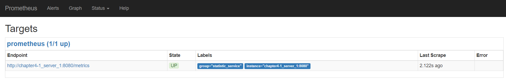
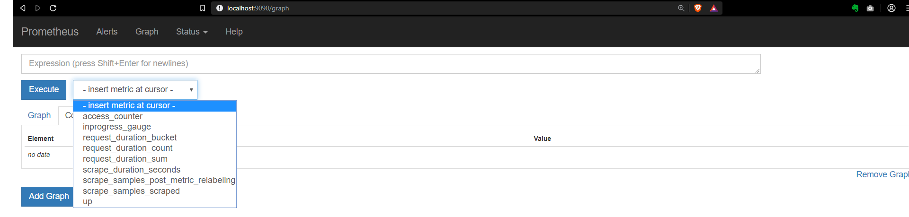

== Metrics & HealthChecks

Eclipse foundation aimed to provide a protocol output for *health checks* and *metrics*

Protocol Repository
****
https://github.com/eclipse/microprofile-health[]

https://github.com/eclipse/microprofile-metrics[]
****

Metrics Definition according to Eclipse foundation::
This specification aims at providing a unified way for
Microprofile servers to export Monitoring data ("Telemetry") to management
agents and also a unified Java API, that all (application) programmers can use to expose their telemetry data.

Health Check Definition according to Eclipse foundation::
Health checks are used to probe the state of a computing node from another
machine (i.e. kubernetes service controller) with the primary target being
cloud infrastructure environments where automated processes maintain the
state of computing nodes.

Helidon SE libraries support MicroProfile metrics. This can be useful for monitoring data for a service.
Metrics supports adds reliability and observability to our service.

Difference of health checks::
*Health Checks* are more "Is my service running?" question. Based on the answer
the service can be restart/terminated or replaced with a new instance. Whereas *Metrics* answers
"How is my service running?". Based on the answer the service can be scaled or discover issues.

=== MetricsSupport

In chapter4 directory there are two runnable servers which we will observe.

The Following dependency must be declared in `*build.gradle*`
file to add Metrics support.

[source, groovy]
----
implementation 'io.helidon.config:helidon-config-yaml:1.0.2'
----

Lets examine a basic server with metric support.

Now open `chapter4/src/main/java/com/cemnura/server/SimpleMetricServer.java`:

[source, java]
----
include::../../chapter4/src/main/java/com/cemnura/server/SimpleMetricServer.java[]
----
<1> import library
<2> register MetricSupport to the server.

Now run the java application and run the following commands.

[sourec, bash]
----
curl -X GET http://localhost:8080/metrics
----

This will get all metrics that is built-in default into Helidon. The request can be retrieved in
text format or JSON format.

[sourec, bash]
----
Text
curl -H "Accept: text/plain" -H "text/plain " -X GET http://localhost:8080/metrics

JSON
curl -H "Accept: application/json" -H "application/json" -X GET http://localhost:8080/metrics

----

Data can be retrieved in different scope such as [red]_base_ , [red]_vendor_ , [red]_application_.

.base
Microprofile base metrics
[sourec, bash]
----
curl -X GET http://localhost:8080/metrics/base
----

.vendor
Helidon Specific metrics
[sourec, bash]
----
curl -X GET http://localhost:8080/metrics/vendor
----

.application:
Application specific metrics
[sourec, bash]
----
curl -X GET http://localhost:8080/metrics/application/
----

WARNING: Since our server is just a basic metric service there is no defined
application metric.

=== Customize Metrics Information

Now let dive into a more complex metrics service and add application specific metrics.

Now open `*chapter4/src/main/java/com/cemnura/service/StatisticService.java*`
[source, java]
----
include::../../chapter4/src/main/java/com/cemnura/service/StatisticService.java[]
----

<1> Create RegistryFactory of MediaType [red]*application*
<2> Access timer to record invocation duration
<3> Access count to record invocation amount
<4> Histogram object to record POST values
<5> Create MetricSupport object custom metrics
<6> Start access timer
<7> Increment access count
<8> Record post value to histogram

We can now POST values to the server and observe the time the request
takes on the server, the amount the service has ben invoked and
the histogram of posted values.

[source, bash]
----

curl -X POST -H "Content-Type: application/json" http://localhost:8080/statistic/record -d "{\"value\":5}"
curl -X POST -H "Content-Type: application/json" http://localhost:8080/statistic/record -d "{\"value\":6}"
curl -X POST -H "Content-Type: application/json" http://localhost:8080/statistic/record -d "{\"value\":6}"

For all application scope:
curl -X GET http://localhost:8080/statistic/metrics/application/

For Specific custom variable in application scope:
curl -X GET http://localhost:8080/statistic/metrics/application/timer
curl -X GET http://localhost:8080/statistic/metrics/application/access_counter
curl -X GET http://localhost:8080/statistic/metrics/application/histogram
----

These metrics provide critical information. For example, you can observe the duration
of responses and scale the application or view the histogram of posted values.

Lets move on to how we visualize these metrics.

=== Visualization With Prometheus

Metrics can also be visualized with Prometheus. Prometheus is a widely used system monitoring and alerting
toolkit widely accepted by the community and also joined the `*Cloud Native Computing Foundation*` in 2016.

Helidon provides Prometheus support. First we must add our dependency.

.Helidon Prometheus Support
[source, groovy]
----
compile 'io.helidon.metrics:helidon-metrics-prometheus:1.0.2'
----

I order to add Prometheus support to the server we must register it to the server.
After we have registered we can develop metrics according to our application requirements.

Custom metrics can be added using Prometheus client library. Prometheus library
Prometheus client library provides four MediaTypes.

Media Types::
* Counter
* Gauge
* Histogram
* Summary

Prometheus Media Types Documentation::
https://prometheus.io/docs/concepts/metric_types/[]

Now open `chapter4-1/src/main/java/com/cemnura/server/MetricServer.java`:
----
include::../../chapter4-1/src/main/java/com/cemnura/server/MetricServer.java[]
----

<1> Register `*PrometheusSupport*` to web server
<2> Register developed service

It is very simple to register Prometheus support to our web server. Prometheus support will enable
our server to have a Url path `*metrics*` which will provide text data for prometheus server.

Execute the following gradle command to generate the server jar.
[source, bash]
----
bash
./gradlew chapter4-1::jar
cmd
gradlew.bat chapter4-1::jar
----

This will generate a build folder in `*chapter4-1*` directory. Now change directory (cd)
into the directory and run the jar file.
[source, bash]
----
java -jar chapter4-1.jar
----

This will run our application server on localhost:8080. Lets examine the `*/metrics*` Url.

[source, bash]
----
curl -X GET http://localhost:8080/metrics
----

.Output of `*/metrics*`
----
# HELP access_counter Shows the numbers of total request
# TYPE access_counter counter // <1>
access_counter 248.0
# HELP inprogress_gauge Shows amount of requests in progress
# TYPE inprogress_gauge gauge <2>
inprogress_gauge 0.0 //
# HELP request_duration Shows the average duration of response
# TYPE request_duration histogram <3>
request_duration_bucket{le="0.005",} 229.0
request_duration_bucket{le="0.01",} 240.0
request_duration_bucket{le="0.025",} 240.0
request_duration_bucket{le="0.05",} 240.0
request_duration_bucket{le="0.075",} 248.0
request_duration_bucket{le="0.1",} 248.0
request_duration_bucket{le="0.25",} 248.0
request_duration_bucket{le="0.5",} 248.0
request_duration_bucket{le="0.75",} 248.0
request_duration_bucket{le="1.0",} 248.0
request_duration_bucket{le="2.5",} 248.0
request_duration_bucket{le="5.0",} 248.0
request_duration_bucket{le="7.5",} 248.0
request_duration_bucket{le="10.0",} 248.0
request_duration_bucket{le="+Inf",} 248.0
request_duration_count 248.0
request_duration_sum 1.1528471
----

These metrics are defined in the `*StatisticService.java*` file which we will examine shortly.
Three MediaTypes are defiened in the StatisticService

<1> `*access_counter*` provides request count made to statistic service
<2> `*inprogress_gauge*` provides information of request in progress of statistic service
<3> `*histogram shows*` provides request response duration information

Now open `chapter4-1/src/main/java/com/cemnura/service/StatisticService.java`:
----
include::../../chapter4-1/src/main/java/com/cemnura/service/StatisticService.java[tag=fields]
----

<1> Create Counter object with `*access_counter*` key and register
<2> Create Gauge object with `*inprogress_gauge*` key and register
<3> Create Histogram object with `*request_duration*` key and register

Methods to start measurements of metrics
----
include::../../chapter4-1/src/main/java/com/cemnura/service/StatisticService.java[tag=snippets]
----

Lets now start a Prometheus server and statistic server
and visualize the metrics.

Run the following command in the directory `*chapter4-1*`
[source, bash]
----
docker-compose up
----

This will build the docker images of the statistic server and
a prometheus server and run it.

WARNING: The port 8080 must not be binded or else the docker image
will not run. View troubleshooting section for resolving binding error.

.Message if run successful
[source, text]
----
server_1  | Apr 16, 2019 10:04:51 PM io.helidon.webserver.NettyWebServer lambda$start$7
server_1  | INFO: Channel '@default' started: [id: 0xbda7f926, L:/0.0.0.0:8080]
server_1  | [INFO ] 2019-04-16 22:04:51.777 [nioEventLoopGroup-2-1] MetricServer - Server running on : http://localhost:8080
server_1  | [DEBUG] (nioEventLoopGroup-3-1) Using Console logging
----

Now you should be able to access prometheus from localhost.

Open Prometheus Server::
****
http://localhost:9090/targets
****

Here we can the state of the statistic service.

Click the graph section

We can see our custom parameters and execute Prometheus
query to visualize the metrics. Click `*access_counter*`
and click `*Execute*`.

Click `*graph*` to see visual of access_count.

Lets now send http get request to the service and view access graph.

.Use siege to make concuurent request
[source, bash]
----
siege -b http://localhost:8080/statistic/min
----

Now return to your Prometheus and see how the request increase.

=== Summary

Monitoring microservices is a important part of microservices
and should not be neglected. Depending on metrics you should scale
the service.
