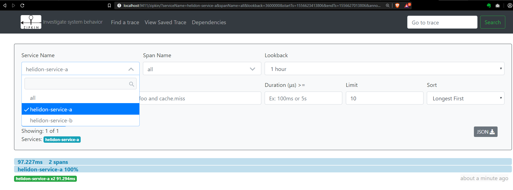
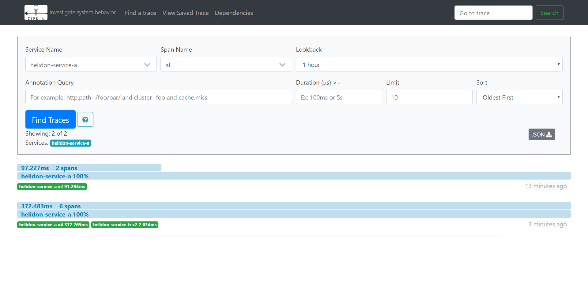

== Helidon Distributed Tracing Support

Helidon libraries supports `*distributed Tracing*`.
Distributed tracing is a methodology used to profile and monitor service applications.

For example::
* How would you pinpoint the point of failure in a large microservice environment?
* How would you examine the duration of a specific service?

Distributed tracing can also be added to a client application and send the tracing data with
jersey-client invocation. That way you can also test your client application duration and traces
calling the backend server.

Distributed tracing allows developers to debug and optimize their code
and also enables DevOPs to examine the service in a production environment.

This chapter we will examine two service in which one service (service-a)
will call a second service (service-b) and get a message from service-b.
Service a and b are simple Hello world like services.
However, we will examine the trace of services invocation between each other
using `*Zipkin*`.

=== Adding Tracing Support to Helidon

Tracing support can be added either by hard coding or via a configuration file.

.Hard Coding
----
ServerConfiguration.builder(...)
    .tracer(TracerBuilder.create("service-a") <1>
        .collectorUri(URI.create("http://localhost:9411")) <2>
        .build()) <3>
----
<1> Configure service tracing name
<2> Determine tracing Url collector
<3> Build `*Tracer*` object

.Configuration
----
include::../../chapter5/a-service/src/main/java/com/cemnura/server/ServerApplication.java[tag=configuration]
----
<1> Configure the server
<2> Configure the tracer

The server configuration will load based on our `*application.yaml*` file

application.yaml::
----
include::../../chapter5/a-service/src/main/resources/application.yaml[]
----

Based on this configuration file our server will::

* expose port 8080
* tracing service name will be `*helidon-service-a*`
* post tracing information to `*zipkin*` Url
* consume service b from `*http://server-b:8080*`

Configuration files allow less configuration clutter.

=== Demonstration Services

Service b is similar to service a therefore we do not need to examine service b.
The only difference between *"service b"* and *"service a"* is that *"service b"* is not a client of *"service a*".

Now open `chapter5/a-service/src/main/java/com/cemnura/service/BServiceClient.java`:
----
include::../../chapter5/a-service/src/main/java/com/cemnura/service/BServiceClient.java[tag=callservice]
----

Here we can see how the span is created and set as the child of the parent request span context.
this span context will be transmitted over to `*service b*` which will add its own traces.

<1> Create span will name of `*service.b.call*`
<2> Add created span as a child of the parent span
<3> start the timer for the span
<4> Add Tracer property to the Jersey Client request
<5> Add Span Context property to the Jersey Client request
<6> Finish span and record duration

Lets build and run the application::
----
In the root proejct directory

HelidonLab>./gradlew chapter5:a-service:jar
HelidonLab>./gradlew chapter5:b-service:jar

HelidonLab>cd chapter5
HelidonLab/chapter5>docker-compose up
----

This should run the following docker containers::

* a-service
* b-service
* zipkin

Services can be access from::

* a-service
    - http://localhost:8081/
* b-service
    - http://localhost:8082/
* zipkin
    - http://localhost:9411/

Now execute the following commands::
[source, bash]
****
curl -X GET http://localhost:8081/
----
Hello from A service
----
curl -X GET http://localhost:8082/
----
Hello from B service
----
****

Open Zipkin in your browser::

http://localhost:9411/

Now you should see the following helidon services registered to `*Zipkin*`.

* helidon-service-a
* helidon-service-b

Select any service and click `*Find Traces*`

Now you can observe the traces that are registered to `*Zipkin*`.

These examples only have 2 spans lets now make service-a call service-b and examine the span.

[source, bash]
****
curl -X GET http://localhost:8081/b

Response
----
Service A got the message from service B: Hello from B service
----
****

As seen in the response service a has called service b and retrieved the greeting message from service b.

Lets examine the span.

Now open `*Zipkin*` in the browser and select `*helidon-service-a*`

You should see a trace of 6 spans.
This is the request trace formed when we invoked
`*http://localhost:8081/b*`.

Now click the registered 6 span trace. You can see what happened how long each span spent. Therefore,
this can be a very important part of a microservice environment.

=== Summary

Tracing can powerful for optimization and debugging analysis. Tracing span can be as detailed as you
desired. There can be many more steps worth tracing such as database connection, authentication, connection etc..
Helidon makes Zipkin tracing significantly easy the only important part is to determine where to trace.

